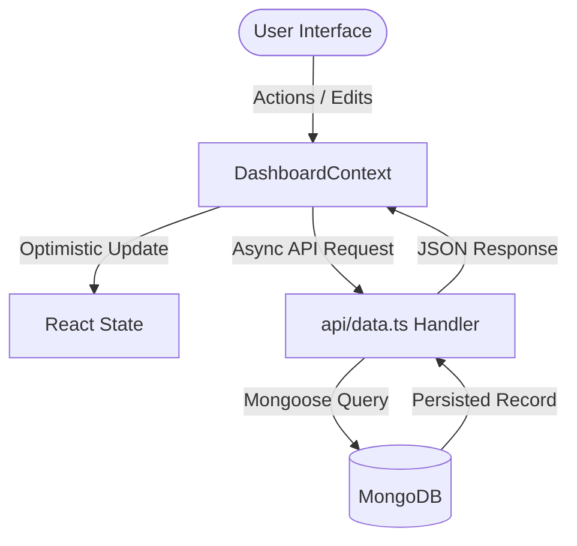

# Internal Product Management Tool - Comprehensive System Wiki

Welcome to the **Internal Product Management Tool Wiki**. This document provides an exhaustive reference of the application architecture, data models, state flow, API endpoints, ClickUp integration, design system, and development guidelines.

---

## Table of Contents
1. [Overview & Tech Stack](#1-overview--tech-stack)
2. [Directory Structure](#2-directory-structure)
3. [Database Models & Schemas](#3-database-models--schemas)
4. [State Management & Data Flow](#4-state-management--data-flow)
5. [Frontend Components & View Modes](#5-frontend-components--view-modes)
6. [Feature Preview Drawer (ProductDetailView)](#6-feature-preview-drawer-productdetailview)
7. [API Routes & Serverless Actions](#7-api-routes--serverless-actions)
8. [ClickUp Integration & Webhooks](#8-clickup-integration--webhooks)
9. [Design System & Theme Tokens](#9-design-system--theme-tokens)
10. [Boat Bot Scratchpad & Sharable Calendar Configuration](#10-boat-bot-scratchpad--sharable-calendar-configuration)
11. [Developer Setup & High-Performance Local Architecture](#11-developer-setup--high-performance-local-architecture)
12. [Dockerization, Amazon ECR & Automated Schedulers](#12-dockerization-amazon-ecr--automated-schedulers)
13. [Type Checking, Linting & Troubleshooting Guide](#13-type-checking-linting--troubleshooting-guide)

---

## 1. Overview & Tech Stack

The **Internal Product Management Tool** is a web application designed for tracking SaaS product operations, sprint planning, student projects, speaker meetings, admin calls, content pipeline, daily issue logs, programmatic challenges, and feature adoption metrics.

### Core Stack:
- **Frontend**: React 19, TypeScript, Vite
- **Styling**: Vanilla CSS Design System ([src/index.css](file:///c:/Users/AKASH/Documents/Internal%20Product%20Tool/src/index.css)) featuring CSS variables, dark/light modes, glassmorphism, responsive grid layouts, and custom badges.
- **Visuals & Effects**: `lucide-react` icons, `PixelBlast` (Three.js / OGL particle canvas background), `jspdf` & `jspdf-autotable` (PDF export), `canvas-confetti` (celebratory sound and confetti on task delivery).
- **Audio Feedback**: Custom Web Audio API synthesizer ([src/utils/audio.ts](file:///c:/Users/AKASH/Documents/Internal%20Product%20Tool/src/utils/audio.ts)) for UI interaction sounds.
- **Backend / API**: Vercel Serverless Function ([api/data.ts](file:///c:/Users/AKASH/Documents/Internal%20Product%20Tool/api/data.ts)) + standalone Node.js HTTP Server ([server/server.ts](file:///c:/Users/AKASH/Documents/Internal%20Product%20Tool/server/server.ts)).
- **Database**: MongoDB with Mongoose ORM ([api/lib/models.ts](file:///c:/Users/AKASH/Documents/Internal%20Product%20Tool/api/lib/models.ts)).

---

## 2. Directory Structure

```
Internal Product Tool/
├── .agents/                        # AI Customization & Knowledge Root
│   ├── AGENTS.md                   # Workspace-scoped rules & architectural overview
│   └── skills/
│       └── repository_knowledge/
│           └── SKILL.md            # Auto-discovered repository knowledge skill
├── api/                            # Backend API Endpoints (Vercel Serverless & Node server)
│   ├── data.ts                     # Unified API handler for GET/POST/PUT/DELETE & AI features
│   ├── webhook.ts                  # ClickUp incoming Webhook receiver & synchronizer
│   └── lib/
│       ├── db.ts                   # High-performance Mongoose connection pooling helper
│       └── models.ts               # Mongoose schemas & TypeScript collection models
├── docs/
│   ├── CI_CD_ECR.md                # Amazon ECR container build & push pipeline instructions
│   └── PROJECT_WIKI.md             # Primary comprehensive system wiki
├── Dockerfile                      # Multi-stage production container build (Node 22 Alpine)
├── public/                         # Static public assets & favicons
├── scripts/
│   └── build-and-push-ecr.sh       # Local ECR build, tag and push automation script
├── server/
│   └── server.ts                   # Node.js HTTP server, SPA static file server & email digest daemon
├── src/
│   ├── App.tsx                     # Main App component, navigation, command search & auth guard
│   ├── index.css                   # Master CSS Design System, theme variables & animations
│   ├── mockData.ts                 # Initial fallback mock dataset
│   ├── types.ts                    # TypeScript interfaces for all data structures
│   ├── components/
│   │   ├── CalendarView.tsx        # Interactive Master Calendar (Month view, source filters)
│   │   ├── ConfigSection.tsx       # Admin configuration, user roles, integrations & form builder
│   │   ├── DashboardOverview.tsx   # Executive analytics dashboard & PDF/CSV report exports
│   │   ├── PublicFeedbackForm.tsx  # Dynamic public feedback form renderer & Google OAuth guard
│   │   ├── ReleaseNotes.tsx        # SaaS product release notes and version changelog viewer
│   │   ├── RichTextEditor.tsx      # Rich text and specifications editor with HTML rendering
│   │   ├── StickyNotesBot.tsx      # Boat Bot Scratchpad & sticky notes sidebar
│   │   ├── TabContainer.tsx        # Dynamic tab navigation container
│   │   ├── Tables.tsx              # Core data tables, modals, ProductDetailView drawer & CustomDatePicker
│   │   ├── TeamView.tsx            # Team workload breakdown & POC capacity viewer
│   │   └── common/
│   │       ├── PixelBlast.tsx      # Interactive Three.js/OGL particle canvas background
│   │       └── PixelBlast.css
│   ├── context/
│   │   └── DashboardContext.tsx    # Global React Context Provider (State, Auth, Sync, Optimistic CRUD)
│   └── utils/
│       ├── audio.ts                # Web Audio API sound synthesizer
│       ├── confetti.ts             # Confetti particle trigger for celebratory actions
│       └── text.ts                 # HTML sanitization and string formatting utilities
├── eslint.config.js                # Flat ESLint configuration with tsconfigRootDir support
├── package.json                    # Scripts and project dependencies
├── tsconfig.app.json               # Frontend TypeScript configuration
├── tsconfig.json                   # Solution root TypeScript configuration
├── tsconfig.server.json            # Node backend TypeScript configuration
└── vite.config.ts                  # Vite config with IPv4 loopback proxy (127.0.0.1:3000)
```

---

## 3. Database Models & Schemas

All models are defined in [api/lib/models.ts](file:///c:/Users/AKASH/Documents/Internal%20Product%20Tool/api/lib/models.ts). Every entity uses a custom `id` string (e.g. `prod-001`, `plan-002`, `proj-003`).

### 1. ProductItem (`ProductItemModel`) - Priority Requests
- `id` (String, unique): Primary key
- `feature` (String): Task title / feature description
- `description` (String): Long form markdown description
- `priority` (String): P0, P1, P2, P3, P4
- `poc` (String): Point of Contact / Assignee name
- `status` (String): Task lifecycle status
- `product` (String): Product Group name
- `module` (String): Module within product group
- `taskLink` (String): ClickUp Task URL
- `clickupStatus` (String): Real-time ClickUp status string
- `clickupSubtasksCount` (Number): Number of subtasks in ClickUp
- `clickupAssignee` (String): ClickUp assignee names
- `blocker` (String): Blocker text if stuck
- `notes` (String): Extra notes and linked tags
- `productDeadline` (String): Specs Date
- `uiux` (String): UI/UX Date
- `deadline` (String): Dev Date
- `finalRelease` (String): Release Date
- `productDeadlineCompleted`, `uiuxCompleted`, `deadlineCompleted`, `finalReleaseCompleted` (Boolean): Milestone completion flags
- `tarunSirApproval` (Boolean): Tarun Sir verified flag
- `raisedByTarunSir` (Boolean): Special priority tag

### 2. PlanItem (`PlanItemModel`) - Sprint Planning
- `id`, `month`, `category` (Development, UI/UX, Product, Release), `task`, `link`, `status`, `completed`, `clickupStatus`, `clickupSubtasksCount`, `clickupAssignee`.

### 3. StudentProject (`StudentProjectModel`)
- `id`, `title`, `description`, `thingsWeBuild`, `status`, `assigned`, `blocker`, `completeInfoDate`, `priority`, `poc`, `taskLink`, `clickupStatus`, `clickupSubtasksCount`, `clickupAssignee`, milestone dates & completion flags.

### 4. AMASession (`AMASessionModel`) & StudentMeeting (`StudentMeetingModel`)
- Track guest speaker AMA sessions and student feedback calls.

### 5. AdminCall (`AdminCallModel`) & TarunSirMeeting (`TarunSirMeetingModel`)
- Operational admin call logs and strategic Tarun Sir meeting notes.

### 6. ContentItem (`ContentItemModel`)
- Content pipeline items: module, subject, type (Video, Article, etc.), draft link, publish date, milestone checkpoints.

### 7. DailyIssue (`DailyIssueModel`)
- Daily issues log: cohort, product, module, type (Bug/Defect, Enhancement), issues description, contact info, priority, POC, status, ClickUp sync.

### 8. FeatureAdoption (`FeatureAdoptionModel`)
- Feature adoption metrics: feature name, product group, launch date, adoption rate %, active users count, sentiment rating (1-5), target audience.

### 9. Challenge (`ChallengeModel`)
- Track operational, programmatic, and cohort-level challenges. Fields:
  - `id` (String, unique): Primary key
  - `title` (String, required): Challenge title
  - `description` (String): Detailed explanation of the challenge
  - `departments` (Array of Strings): Multi-select department tags
  - `programs` (Array of Strings): Multi-select program boundaries
  - `cohorts` (Array of Strings): Multi-select cohort associations
  - `poc` (String): Point of Contact assigned to resolve
  - `solution` (String): Resolution text when status is Solved
  - `status` (String): Pending, In Progress, Solved, Unsolved
  - `priority` (String): High, Medium, Low
  - `relatedTaskId` (String): References a Product Feature ID (`ProductItem.id`)
  - `isBlocker` (Boolean): Flag indicating if it blocks progress
  - `loggedDate` (String): Date logged

### 10. System Configurations (`ConfigSpeakerModel`, `ConfigProductGroupModel`, `ConfigStatusModel`, etc.)
- User authentication accounts, Product taxonomies, custom status colors & scopes, programs, cohorts, and global settings.

---

## 4. State Management & Data Flow

State is centrally managed by `DashboardProvider` in [src/context/DashboardContext.tsx](file:///c:/Users/AKASH/Documents/Internal%20Product%20Tool/src/context/DashboardContext.tsx).



### Key Context Methods:
- `loginUserByEmail(credential)`: Authenticates user with Google OAuth or email.
- `updateProductItem(id, updates)`: Performs optimistic update on product item state and syncs with backend.
- `syncClickupTask(taskLink)`: Calls ClickUp API to fetch live status, assignee, and subtask count.
- `openPreviewForFeature(featureName, fallbackData)`: Searches or creates a feature record and opens the detail drawer (`setPreviewProductId`).
- `updateChallenge(id, updates)`, `addChallenge(item)`, `deleteChallenge(id)`: CRUD state helper methods for managing challenges.
- `fetchPaginatedMeetingsData(options)`: Supports server-side pagination fetching for meetings, daily issues, feature requests, and challenges, with query parameters filtering by search text, statuses, programs, POCs, departments, cohorts, and blockersOnly flags.

### Pagination Strategy

The system uses a hybrid pagination model optimized for different data-access profiles:

1. **Client-side Pagination & State Syncing**:
   - Applied to core entities like **Product Features (Priority Requests)** and **Sprint Planning**.
   - These datasets are lightweight, allowing full bootstrap loading upon application initialization (`GET /api/data?action=init`).
   - Mutations are immediately processed on the client side using optimistic state updates, providing an instantaneous user experience.

2. **Server-side Pagination (`fetchPaginatedMeetingsData`)**:
   - Applied to historically large logs and issue-tracking entities: **AMA Meetings**, **Admin Calls**, **Meetings with Tarun Sir**, **Daily Issues & Feature Requests**, and **Challenges Tracker**.
   - The frontend maintains local tracking of `currentPage` and `itemsPerPage` parameters, calling `fetchPaginatedMeetingsData` reactively whenever searches or filters (such as status, priority, department, or blocker flags) change.
   - The server handler in [api/data.ts](file:///c:/Users/AKASH/Documents/Internal%20Product%20Tool/api/data.ts) handles these requests by running database-level filters, checking counts for total matching documents, and returning only the paginated slice corresponding to the selected page size (e.g. `limit: 20`).

---

## 5. Frontend Components & View Modes

### 1. Dashboard Overview ([DashboardOverview.tsx](file:///c:/Users/AKASH/Documents/Internal%20Product%20Tool/src/components/DashboardOverview.tsx))
- **KPI Metrics Cards**: Total Features, In Progress, Released, Overdue, Critical P0s.
- **Interactive Filters**: Date Range (All Time, Today, This Week, This Month, Custom Date Range), Status Scope, Hide Released toggle.
- **Status Distribution**: Visual progress bars per status.
- **Active Workload by POC**: Workload breakdown badges showing active tasks assigned to each team member.
- **Export Actions**: Export PDF Report (jsPDF with styled tables) and Export CSV.

### 2. Master Calendar View ([CalendarView.tsx](file:///c:/Users/AKASH/Documents/Internal%20Product%20Tool/src/components/CalendarView.tsx))
- Monthly grid calendar aggregating events across Product Features, Projects, Meetings, Admin Calls, Tarun Sir Meetings, Content Pipeline, and Daily Issues.
- Category source toggle checkboxes.
- Clicking any event badge triggers `openPreviewForFeature` to inspect details.

### 3. Data Tables ([Tables.tsx](file:///c:/Users/AKASH/Documents/Internal%20Product%20Tool/src/components/Tables.tsx))
- Interactive tables for each domain tab with inline editing, sorting, filtering, ClickUp sync buttons, and batch CSV importing.
- **Challenges Tracker (`ChallengesTable`)**:
  - Displays programmatic and cohort challenges with server-side pagination.
  - Multi-select Cascaded Dropdown Logic: Selecting a Program dynamically filters the available Cohorts; selecting Cohorts/Programs dynamically filters the Departments. Auto-cleans selections if dependencies change. Includes custom text field fallback.
  - Search by title, description, or POC, and filter by status, priority, department, and blocker status.
  - Inline Solution Resolution input that prompts for details only when a challenge status is transitioned to "Solved".
  - Ability to associate and link challenges to a specific Product Feature.
- **Feature Adoption Table (`AdoptionTable`)**:
  - Sticky merged "Feature & Product Group" column styled with borders and group colours.
  - Clear vertical program boundary dividing lines separating cohorts of different academic programs.
  - Dynamic adoption rate calculations based on active visible cohorts.

### 4. Admin Integrations Access Lock ([ConfigSection.tsx](file:///c:/Users/AKASH/Documents/Internal%20Product%20Tool/src/components/ConfigSection.tsx))
- Restricts access to ClickUp Integration API setups.
- Non-admin users (`currentUser.isAdmin === false`) see a lock 🔒 symbol on the "Integrations" subtab. Clicking it displays a `LockedIntegrationsView` blocking sensitive credentials exposure.

---

## 6. Feature Preview Drawer (ProductDetailView)

The feature preview page (`ProductDetailView` in [Tables.tsx](file:///c:/Users/AKASH/Documents/Internal%20Product%20Tool/src/components/Tables.tsx#L2161)) is the primary workspace drawer for inspecting and managing an individual task:

1. **Title & Inline Linking**: Title text input with real-time DB duplicate/similar task suggestions and "Link Task" widget.
2. **Milestone Checkpoints Timeline**:
   - Step 0: Created Date
   - Step 1: Specs Date (`productDeadline`) — displays days elapsed since **Created Date**
   - Step 2: UI/UX Date (`uiux`) — displays days elapsed since **Specs Date**
   - Step 3: Dev Date (`deadline`) — displays days elapsed since **UI/UX Date** (or Specs Date)
   - Step 4: Release Date (`finalRelease`) — displays days elapsed since **Dev Date** (or preceding milestones)
   - Progress connector line automatically updates fill percentage based on completed milestones.
3. **Popup Calendar (`CustomDatePicker`)**:
   - `position: absolute; top: 110%; zIndex: 10005`.
   - Parent `.premium-timeline-container` uses `z-index: 20` (and `z-index: 50` when editing), and `.premium-timeline-node` uses `z-index: 100` when editing.
   - Alignment is dynamically set to `align={idx <= 1 ? 'left' : 'right'}` to avoid clipping off-screen.
4. **Properties Grid Dashboard**:
   - Panel 1: Product Group selector, Status dropdown (`StatusDropdown`), ClickUp Link & Status badge, ClickUp Assignee & subtasks.
   - Panel 2: POC Owner selector with active task counts, Blocker input, Tarun Sir Approval toggle.
5. **Change History Modal**: Complete audit trail showing historical date and POC changes.
6. **Comments Section**: Threaded discussion comments.

---

## 7. API Routes & Serverless Actions

All backend operations route through [api/data.ts](file:///c:/Users/AKASH/Documents/Internal%20Product%20Tool/api/data.ts).

### Endpoints:
- `GET /api/data?action=init`: Bootstrap payload includes `challenges` along with speakers, status, settings, etc.
- `GET /api/data?action=dashboard-counts`: Aggregates KPI statistics, status metrics, and POC workloads filtered by date range.
- `GET /api/data?action=dashboard-list`: Paginated fetch for dashboard modal drilldowns.
- `GET /api/data?action=calendar-events`: Aggregates events across 7 collections for master calendar view.
- `GET /api/data?action=single-task&id=<taskId>`: Retrieves a single item by ID.
- `GET /api/data?action=suggest-similar&query=<q>`: Performs regex search for similar task titles in DB.
- `GET /api/data?action=global-search&query=<q>`: Global command palette search across all entities.
- `GET /api/data?action=paginated-meetings-data`: Performs server-side pagination for meeting lists, issues, feature requests, and challenges (`type=challenges`). Supports query parameters: `search`, `limit`, `page`, `priority`, `statuses`, `departments`, `cohorts`, and `blockersOnly`.
- `POST /api/data?action=clickup-sync`: Syncs ClickUp status, subtasks count, and assignee for a given ClickUp URL.
- `POST /api/data?action=clickup-bulk-sync`: Iterates over product items with ClickUp URLs and syncs them.
- `POST /api/data?action=create&type=<entity>`: Creates a new document.
- `PUT /api/data?action=update&type=<entity>`: Updates document fields and creates a `ChangeHistory` record if dates/POC are modified.
- `DELETE /api/data?action=delete&type=<entity>&id=<id>`: Deletes a document by ID.
- `POST /api/data?action=login`: Validates user credentials or Google OAuth token.

---

## 8. ClickUp Integration & Webhooks

1. **API Key Setup**: Admin configures ClickUp API key in settings (`GlobalSettingsModel` key `clickup_api_key`).
2. **Single Task Sync**: `syncClickupTask(url)` extracts ClickUp task ID from link (e.g. `https://app.clickup.com/t/8695abc`), queries ClickUp v2 REST API (`https://api.clickup.com/api/v2/task/{id}`), updates status, subtasks count, and assignee.
3. **Webhooks (`api/webhook.ts`)**: Handles incoming ClickUp webhook POST requests (`taskUpdated`, `taskStatusUpdated`) and updates MongoDB records in real time.

---

## 9. Design System & Theme Tokens

All styling rules are defined in [src/index.css](file:///c:/Users/AKASH/Documents/Internal%20Product%20Tool/src/index.css).

### Key CSS Variables:
- `--primary`: Main accent purple `#7c5cbf`
- `--primary-glow`: Subtle transparent accent glow `rgba(124, 92, 191, 0.15)`
- `--background`: Primary canvas background
- `--background-alt`: Card & panel background
- `--text-primary`, `--text-secondary`, `--text-muted`: Typography hierarchy tokens
- `--border`, `--border-light`: Border rules

### UI Component CSS Classes:
- `.premium-workspace`: Full screen workspace wrapper.
- `.premium-timeline-container`, `.premium-timeline-node`: Milestone timeline.
- `.properties-panel`, `.property-row-flat`: Metadata dashboard panels.
- `.badge`: Status and priority pill badges.
- `.status-dropdown-container`: Custom status selector button and popover menu.
- `.sticky-col`: Sticky table cell helper positioning elements to the left (`left: 0`, elevated `z-index: 2`, matching surface backgrounds).
- `.sticky-header-col`: Sticky table header cell positioning header column headers to the left (`left: 0`, `top: 0`, high `z-index: 12`).

### Premium UI/UX Design Principles

The application relies on a tailored custom design system to create a modern, high-end, and responsive workspace:

1. **Aesthetic Visual Design (Glassmorphism & Contrast)**:
   - Built on a dark, sophisticated backdrop utilizing CSS color variables.
   - Employs **glassmorphic panels** with translucent backgrounds (`var(--panel-bg)`), thin border separations (`var(--border-light)`), and subtle drop-shadows to establish depth.
   - Highlights actionable objects and milestones with glowing hover styles and gradients.

2. **PixelBlast Interactive Particle Background**:
   - Incorporates a dynamic, interactive canvas background (`PixelBlast.tsx`) powered by Three.js/OGL that renders particles reacting fluidly to mouse movement.

3. **High-Fidelity Audio Synthesis**:
   - Powered by a custom **Web Audio API Synthesizer** ([audio.ts](file:///c:/Users/AKASH/Documents/Internal%20Product%20Tool/src/utils/audio.ts)) which generates real-time, non-blocking click and pop sound feedback for navigation interactions and panel toggles.

4. **Dynamic Timelines & Celebrations**:
   - The milestone progress bar uses SVG connectors to draw linear progress from Created to Specs -> UI/UX -> Dev -> Release.
   - Completing a critical delivery milestone triggers a celebration pop-up using `canvas-confetti` alongside audio success feedback.

---

## 10. Boat Bot Scratchpad & Sharable Calendar Configuration

### Boat Bot Scratchpad Assistant
- **Overview**: A fully free, self-contained sidebar scratchpad panel designed for quick notes, checklists, and context clipboards. Stored directly in MongoDB, eliminating AI API usage costs.
- **Features**:
  - **Dynamic Input**: An auto-expanding `<textarea>` input field that grows based on typed content, supporting standard Chat keyboard shortcuts (Enter to add note, Shift+Enter for new lines).
  - **Minimal Completed Notes Drawer**: A dedicated collapsible Completed Notes panel at the bottom of the active note cards. Designed with a clean top divider line and uppercase minimal action triggers (Delete all, Restore all).
  - **Paginated Lazy Loading**: Rather than retrieving all notes on startup, completed notes are lazily fetched in pages of 5 on demand when the Completed Notes section is expanded, optimizing query performance.

### Sharable Calendar Config & Filtering
- **Visibility Settings**: Located in the Admin Configuration tab under **Sharable Calendar**.
- **Worksheet Visibility Sources**: Allows selecting specific databases (e.g. Priority Requests, Student Projects, Daily Issues Log) to share.
- **Worksheet Date Milestones**: Configurable stage filters (Specs Date, UI/UX Date, Dev Date, Release Date).
- **Backend Event Filtering**: When accessed via a public read-only link (`public-calendar=true`), the `/api/data?action=calendar-events` endpoint automatically filters out both unselected worksheet sources and unselected milestone stages, providing robust context-level privacy control.

---

## 11. Developer Setup & High-Performance Local Architecture

### Running Locally

To run the application locally with full database connectivity and sub-second response times, start the backend server and frontend development server in two separate terminals:

```bash
# Terminal 1: Backend Server (Node.js HTTP Server on http://localhost:3000)
npm start
# (Alternatively: npm run dev:server to automatically rebuild server files)

# Terminal 2: Frontend Dev Server (Vite on http://localhost:5173)
npm run dev
```

> [!IMPORTANT]
> **Do not run `npx vercel dev` simultaneously!**
> The local Node server (`node server.js`) and `vercel dev` both bind to port 3000. Running both simultaneously causes an `EADDRINUSE: address already in use 0.0.0.0:3000` collision between IPv4 and IPv6 sockets, causing requests to stall or fail. Always use `npm start` for local development.

### High-Performance Local Architecture

The local server environment is tuned to match and exceed live cloud speeds (~630ms for full data initialization):
1. **IPv4 Loopback Proxy**: [vite.config.ts](file:///c:/Users/AKASH/Documents/Internal%20Product%20Tool/vite.config.ts) routes `/api` directly to `http://127.0.0.1:3000` rather than `localhost`, bypassing dual-stack IPv6 DNS resolution latency.
2. **Mongoose Connection Pooling**: [api/lib/db.ts](file:///c:/Users/AKASH/Documents/Internal%20Product%20Tool/api/lib/db.ts) configures `maxPoolSize: 50` and `minPoolSize: 10`, allowing the 25 independent collection queries in `action=init` to execute concurrently without queuing.
3. **Immediate GET Stream Bypassing**: [server/server.ts](file:///c:/Users/AKASH/Documents/Internal%20Product%20Tool/server/server.ts) exits early for `GET` and `HEAD` requests before stream chunk consumption, eliminating socket keep-alive pauses.
4. **Environment Auto-Loading**: `npm start` automatically includes `--env-file-if-exists=.env --env-file-if-exists=.env.local` to inject `MONGODB_URI` without requiring manual shell export commands.

---

## 12. Dockerization, Amazon ECR & Automated Schedulers

### Container Build & Deployment
The repository includes a multi-stage [Dockerfile](file:///c:/Users/AKASH/Documents/Internal%20Product%20Tool/Dockerfile) optimized for production deployments:
- **Base image**: `node:22-alpine` for minimal image footprint.
- **Stage 1 (`deps`)**: Installs clean production and development dependencies (`npm ci`).
- **Stage 2 (`build`)**: Compiles both Vite frontend (`npm run build`) and Node server TypeScript (`npm run build:server`).
- **Stage 3 (`runtime`)**: Minimal runtime container packaging only `/dist` and `/server-dist` with non-root user (`USER node`).

To build and push to Amazon ECR:
```bash
# Using the local helper script:
./scripts/build-and-push-ecr.sh

# Or via AWS CLI:
aws ecr get-login-password --region ap-south-1 | docker login --username AWS --password-stdin 770014814665.dkr.ecr.ap-south-1.amazonaws.com
docker build -t 770014814665.dkr.ecr.ap-south-1.amazonaws.com/akash_ipmt:latest .
docker push 770014814665.dkr.ecr.ap-south-1.amazonaws.com/akash_ipmt:latest
```

The container listens on port `3000` and provides a healthcheck endpoint at `GET /healthz`.

### Background Automated Email Digest Scheduler
[server/server.ts](file:///c:/Users/AKASH/Documents/Internal%20Product%20Tool/server/server.ts) runs a persistent background daemon (`runEmailDigestScheduler`) that executes every 60 seconds:
- Evaluates the current time and day in the `Asia/Kolkata` (IST) timezone.
- Inspects database settings for `digestFrequency` (everyday / weekly), `digestTime` (e.g. `09:00`), and `digestDayOfWeek` (e.g. `Monday`).
- When a schedule match occurs, it automatically dispatches the HTML Product Ship summary digest via SMTP to configured stakeholders.

---

## 13. Type Checking, Linting & Troubleshooting Guide

### Verification Commands:
```bash
# TypeScript type check (App & Frontend)
npx tsc --noEmit

# Build server TypeScript files
npm run build:server

# ESLint code verification
npm run lint
```

### Common Issues & Troubleshooting:

| Issue | Cause | Solution |
| :--- | :--- | :--- |
| `Error: listen EADDRINUSE: address already in use 0.0.0.0:3000` | A background server instance (or `vercel dev`) is already holding port 3000. | In PowerShell, run `Stop-Process -Id (Get-NetTCPConnection -LocalPort 3000).OwningProcess -Force` or close the other running terminal. |
| `Database connection failed` on API calls | `MONGODB_URI` environment variable is missing or empty. | Ensure `.env` exists in the project root with a valid `MONGODB_URI`, and start the server using `npm start` or `npm run dev:server`. |
| ESLint multi-root parsing error | ESLint could not locate the root `tsconfig.json` across candidate worktrees. | Configured via `tsconfigRootDir: import.meta.dirname` in [eslint.config.js](file:///c:/Users/AKASH/Documents/Internal%20Product%20Tool/eslint.config.js). |
| Slow initial page load locally | Vite proxy attempting IPv6 lookup or Mongoose connection pool queuing. | Ensure `vite.config.ts` proxies to `127.0.0.1:3000` and `api/lib/db.ts` uses `maxPoolSize: 50`. |

---

## 14. Discussion Area & Multi-Blocker Resolution System
Tasks across Priority Requests, Daily Needs, Student Projects, and Content Pipeline support multiple structured blockers merged directly inside the **Discussion Area**:
- **Unified Discussion Panel**: No separate tabs for blockers. The top of the Discussion sidebar features an interactive Blockers container displaying active counts, resolve status checkboxes (`[ ] Resolved`), resolution timestamps, author tags, and quick-add inputs.
- **Status Badges & Row Highlighting**: Items with unresolved blockers display a warning badge in the property grid and apply `.row-blocked` (red indicator) to table rows.
- **Sync & Compatibility**: Active blockers automatically sync to the legacy `blocker` string (`b1; b2`) ensuring backward compatibility with tables, filters, exports, and calendar indicators.

